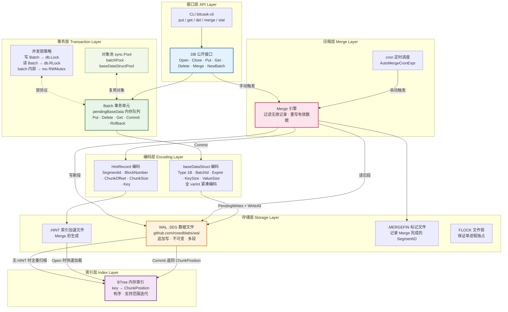
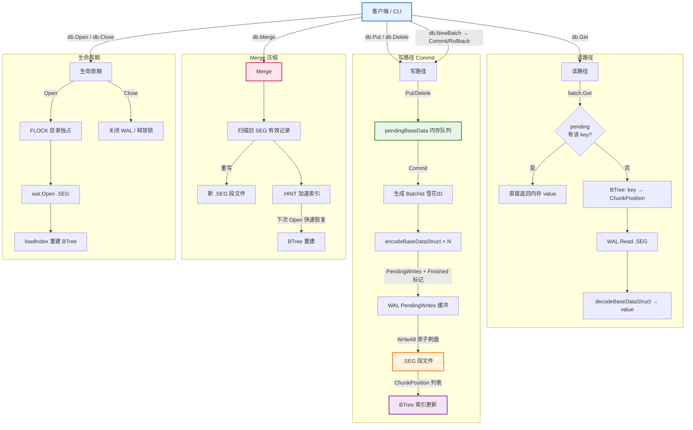

# BitcaskDB

基于 [Bitcask 论文](https://riak.com/assets/bitcask-a-log-structured-hash-table-for-fast-key-value-data.pdf) 实现的嵌入式 KV 存储引擎。WAL 层复用 [rosedblabs/wal](https://github.com/rosedblabs/wal)，上层自实现 Batch 事务、BTree 内存索引和 Merge 压缩。

---

## 1. 设计

### 存储模型

Bitcask 的核心约定：**所有 key 常驻内存，value 只写磁盘**。

写操作只做追加，不修改已有数据，`.SEG` 段文件是不可变的。BTree 在内存维护完整的 `key → ChunkPosition` 映射，读取任意 key 只需一次磁盘寻址。这个模型对写性能非常友好（顺序 I/O），读性能也稳定（固定一次 seek），代价是内存里必须放得下所有 key。

启动时扫描 WAL 重建 BTree 索引。有 `.HINT` 文件时跳过数据段直接加载，重启速度快很多。

### Batch 事务

多条 Put/Delete 先写入内存的 `pendingBaseData` 队列，Commit 时统一编码，调用 `WAL.PendingWrites + WriteAll` 原子刷盘。末尾追加一条 `Finished` 标记记录（Key 为雪花 BatchId），崩溃重放时以此为原子边界——没找到 Finished 的批次整批丢弃。

`db.Put` / `db.Delete` 内部也是走 Batch，每次单条 Commit，从对象池借 Batch 用完归还。

### Merge 压缩

追加写会产生历史版本，Merge 负责回收。遍历旧 SEG 段，对比当前索引过滤掉被覆盖或已删除的记录，仅重写有效数据到新段。同时生成 `.HINT` 索引文件，供下次启动快速加载。支持 cron 表达式定时触发，也可以手动调用。

Merge 前后的启动耗时差距明显：同样 50K 个 key、100 万次写入，Merge 后重启约 **190µs**，不 Merge 扫描全量 WAL 约 **4100ms**。

### 并发模型

写 Batch 持 `db.Lock`，只读 Batch 持 `db.RLock`，读操作之间不互斥。Batch 内部有独立的 `mu RWMutex`，同一个 Batch 的 Put/Get 也是并发安全的。对象池（`sync.Pool`）和编码缓冲池（`bytebufferpool`）减少高频写下的 GC 压力。

### 适用场景

适合 key 数量可以装进内存、写多于改的场景：日志、事件流、配置存储、短生命周期的任务状态。不适合 key 数量极大（几十亿级别）或需要范围扫描 value 的场景。

---

## 2. 性能参考

测试环境：Intel i7-14700HX，Windows，value 大小 4KB。

```
BenchmarkPut-28              320425      7214 ns/op    567 B/op    11 allocs/op
BenchmarkPut_Overwrite-28    327026      7027 ns/op    490 B/op     9 allocs/op
BenchmarkGet-28              697806      3673 ns/op    480 B/op     9 allocs/op
BenchmarkBatchPut100-28       20547    107869 ns/op  121647 B/op   855 allocs/op  (~926K key/s)
BenchmarkDelete-28           299775      7838 ns/op    512 B/op    11 allocs/op
BenchmarkPutParallel-28      247880      9546 ns/op    588 B/op    11 allocs/op
BenchmarkGetParallel-28      399093      5610 ns/op    480 B/op     9 allocs/op
BenchmarkMixedReadWrite-28   323163      7453 ns/op    512 B/op     9 allocs/op
BenchmarkReopen-28               49  55066018 ns/op                (10000 keys，冷启动 ~55ms)
```

运行 benchmark：

```bash
go test -bench="Benchmark" -benchmem -benchtime=3s -run="^$" ./benchmark/
```

---

## 3. 架构

### 整体分层



### 操作流程



---

## 4. 快速开始

环境要求：Go 1.21+

**基本用法**

```go
db, err := bitcaskdb.Open(bitcaskdb.DbDefaultOptions)
if err != nil {
    log.Fatal(err)
}
defer db.Close()

_ = db.Put([]byte("key"), []byte("value"))

val, _ := db.Get([]byte("key"))
fmt.Println(string(val))

_ = db.Delete([]byte("key"))
```

**批量事务**

多条写操作需要原子提交时使用 Batch。注意：必须先调用 `batch.Lock()` 再操作，Commit 内部会自动 Unlock。

```go
batch := db.NewBatch()
batch.Lock()

_ = batch.Put([]byte("k1"), []byte("v1"))
_ = batch.Put([]byte("k2"), []byte("v2"))
_ = batch.Delete([]byte("old-key"))

if err := batch.Commit(); err != nil {
    _ = batch.Rollback()
    log.Fatal(err)
}
```

**CLI**

```bash
go run ./cmd/bitcask-cli

> put mykey myvalue
> get mykey
> del mykey
> merge
> stat
```

---

## 5. 配置项

| 字段 | 默认值 | 说明 |
| :--- | :--- | :--- |
| `DirPath` | `./data` | 数据目录，不存在时自动创建 |
| `SegmentSize` | `1 GB` | 单个 `.SEG` 文件大小上限，超出后滚动新文件 |
| `Sync` | `false` | `true` 时每次写后立即 fsync，牺牲吞吐保证持久性(严重影响性能) |
| `AutoMergeCronExpr` | `0 0 * * *` | 标准 5 位 cron 表达式，空字符串则关闭自动 Merge |

---

## 6. 数据文件

```
data/
├── 000000001.SEG       # WAL 数据段，追加写，存放所有 KV 记录
├── 000000002.SEG       # 超过 SegmentSize 后自动滚动新文件
├── 000000001.HINT      # Merge 后生成，存储 key → ChunkPosition 映射
├── 000000001.MERGEFIN  # Merge 完成标记，记录已合并的最大 SegmentID
└── FLOCK               # 进程独占文件锁
```

**Record 编码格式**

```
┌────────┬──────────┬──────────┬─────────┬───────────┬─────┬───────┐
│ Type   │ BatchId  │ Expire   │ KeySize │ ValueSize │ Key │ Value │
│ 1 byte │ varInt64 │ varInt64 │ varInt  │ varInt    │ ... │ ...   │
└────────┴──────────┴──────────┴─────────┴───────────┴─────┴───────┘
```

- `Type`：`Normal(0)` / `Deleted(1)` / `Finished(2)`
- `BatchId`：雪花 ID，同一 Batch 的所有记录共享同一个 BatchId
- `Finished` 记录的 Key 即为 BatchId 字节序列，崩溃恢复时以此为原子边界
